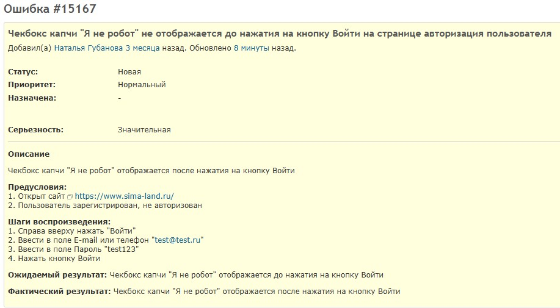
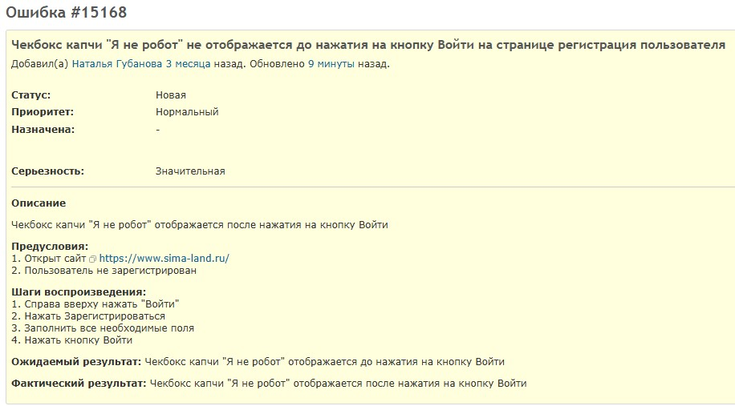
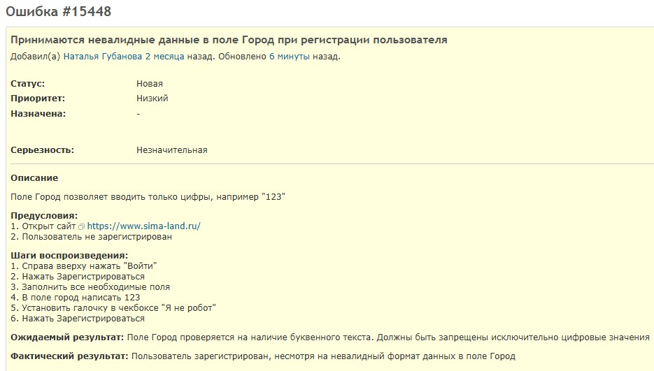
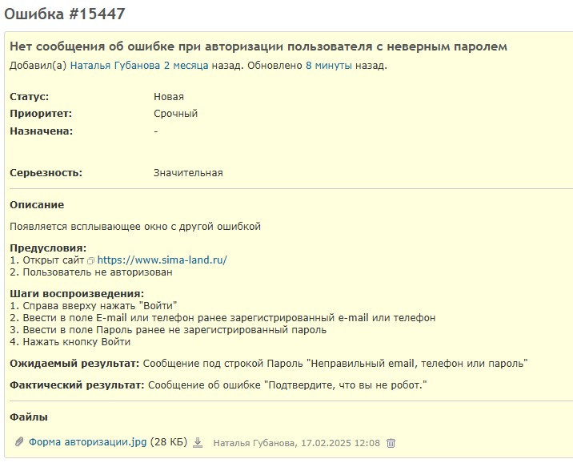
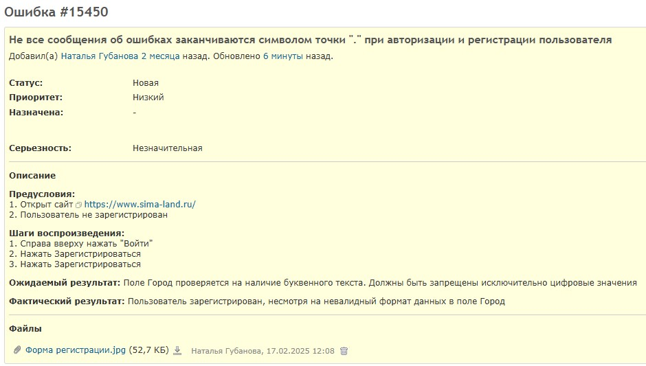

# ⏱️ Отчёт по сессии тестирования — Sima-Land

**Сайт:** https://www.sima-land.ru/

## Миссия / Функционал

Проверить удобство и корректность регистрации, авторизации и функций личного кабинета пользователя.

Функционал:

1. Регистрация пользователя
2. Авторизация пользователя
3. Управление личным кабинетом

## ФИО

Гуанова Наталья Юрьевна

## Дата и время начала

15.12.13:50

## TBS-метрики

- Общая длительность: 120 минут
- Время на подготовку: 15 минут
- Время на тестирование: 90 минут
- Время на изучение и регистрацию дефектов: 15 минут

## Данные для тестирования

- Чек-лист Регистрация пользователя
- Чек-лист Авторизация пользователя
- Чек-лист Редактирование пользователя

## Заметки

При регистрации пользователя в поле для пароля минимальная длина пароля не указана до момента ввода пароля. Если пользователь пытается ввести пароль меньше минимального, появляется сообщение о необходимости увеличить его длину.

## Вопросы и проблемы

Чекбокс капчи отображается после нажатия на кнопку Войти. Это функциональность сайта или ошибка?

## Найденные дефекты

### Чекбокс капчи «Я не робот» не отображается до нажатия на кнопку Войти на странице авторизация пользователя

### Чекбокс капчи «Я не робот» не отображается до нажатия на кнопку Войти на странице регистрация пользователя

### Принимаются невалидные данные в поле Город при регистрации пользователя

### Нет сообщения об ошибке при авторизации пользователя с неверным паролем

### Не все сообщения об ошибках заканчиваются символом точки при авторизации и регистрации пользователя

