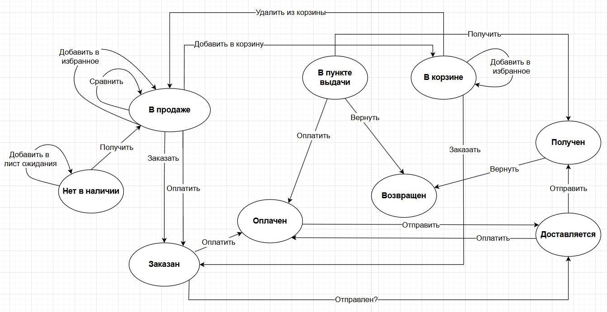

# 🔄 Состояния и переходы — Sima-Land

**Сайт:** https://www.sima-land.ru/  
**Объект:** Товар

Данная техника тестирования использовалась для проверки объекта «Товар».

## Схема состояний и переходов

## Таблица состояний и переходов

### Часть 1

| Состояние | Добавить в корзину | Удалить из корзины | Заказать | Оплатить | Получить |
|:---:|:---:|:---:|:---:|:---:|:---:|
| В продаже | В корзине | Не может произойти | Заказан | Заказан | Не может произойти |
| Заказан | Не может произойти | Не может произойти | Не может произойти | Оплачен | Не может произойти |
| Оплачен | Не может произойти | Не может произойти | Не может произойти | Не может произойти | Не может произойти |
| Возвращен | В корзине | Не может произойти | Заказан | Не может произойти | Не может произойти |
| Нет в наличии | Не может произойти | Не может произойти | Не может произойти | Не может произойти | В продаже |
| Доставляется | Не может произойти | Не может произойти | Не может произойти | Оплачен | Не может произойти |
| Получен | Не может произойти | Не может произойти | Не может произойти | Не может произойти | Не может произойти |
| В корзине | Не может произойти | В продаже | Заказан | Не может произойти | Не может произойти |
| В пункте выдачи | Не может произойти | Не может произойти | Не может произойти | Оплачен | Получен |

### Часть 2

| Состояние | Сравнить | Добавить в избранное | Вернуть | Отправить |
|:---:|:---:|:---:|:---:|:---:|
| В продаже | В продаже | В продаже | Не может произойти | Не может произойти |
| Заказан | Не может произойти | Не может произойти | Не может произойти | Доставляется |
| Оплачен | Не может произойти | Не может произойти | Не может произойти | Доставляется |
| Возвращен | В продаже | В продаже | Не может произойти | Не может произойти |
| Нет в наличии | Не может произойти | Не может произойти | Не может произойти | Не может произойти |
| Доставляется | Не может произойти | Не может произойти | Не может произойти | Получен |
| Получен | Не может произойти | Не может произойти | Возвращен | Не может произойти |
| В корзине | Не может произойти | В продаже | Не может произойти | Не может произойти |
| В пункте выдачи | Не может произойти | Не может произойти | Возвращен | Не может произойти |

## Чек-листы

### Добавление товара

#### ✅ Позитивные тесты

- Добавить товар в избранное из имеющихся в продаже
- Сравнить товар из имеющихся в продаже
- Добавить в лист ожидания товар, отсутствующий в продаже
- Добавить товар в корзину из имеющихся в продаже
- Добавить возвращенный товар в корзину
- Добавить товар в избранное из корзины
- Удалить товар из корзины

#### ❌ Негативные тесты

- Добавить товар в корзину, находящийся в ПВЗ
- Добавить полученный товар в корзину
- Добавить товар в корзину, находящийся на этапе доставки
- Добавить товар в корзину отсутствующий в продаже

### Заказ товара

#### ✅ Позитивные тесты

- Заказать товар из корзины
- Заказать возвращенный товар
- Заказать товар из имеющихся в продаже

#### ❌ Негативные тесты

- Заказать уже заказанный товар
- Заказать возвращенный товар
- Заказать товар, отсутствующий в продаже
- Заказать уже полученный товар
- Заказать товар находящийся в ПВЗ
- Заказать товар, находящийся на этапе доставки
- Заказать товар из пустой корзины
- Заказать оплаченный товар

### Оплата товара

#### ✅ Позитивные тесты

- Оплатить товар в ПВЗ
- Оплатить товар, находящийся на этапе доставки
- Оплатить заказанный товар
- Оплатить товар имеющийся в продаже

#### ❌ Негативные тесты

- Оплатить уже оплаченный товар
- Оплатить возвращенный товар
- Оплатить товар, отсутствующий в продаже
- Оплатить полученный товар
- Оплатить товар, находящийся в ПВЗ
- Оплатить товар, не оформленный в заказ

### Доставка и возврат товара

#### ✅ Позитивные тесты

- Вернуть товар, находящийся на этапе доставки
- Вернуть товар в ПВЗ
- Вернуть заказанный товар.
- Вернуть полученный товар
- Вернуть оплаченный товар
- Доставить оплаченный заказ

#### ❌ Негативные тесты

- Вернуть неоплаченный товар
- Вернуть уже возвращенный товар
- Вернуть товар, отсутствующий в продаже
- Вернуть товар, который не был заказан
