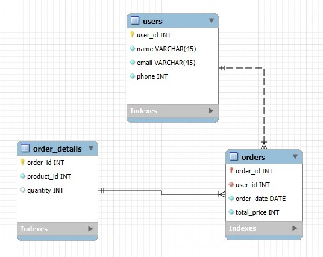

# 🗄️ SQL-запросы

## Работа с таблицей товаров

### 1. Вывод таблицы

```sql
SELECT * FROM store.product;
```

### 2. Добавление товара

```sql
INSERT INTO product (id, name, category, brand, price, quantity)
VALUES (6, 'Тетрадь 12 листов в клетку', 'Канцтовары', 'ErichKrause', 15.90, 100);

SELECT * FROM product;
```

### 3. Удаление товара

```sql
DELETE FROM product
WHERE id = 6;

SELECT * FROM product;
```

### 4. Товары из категории Канцтовары

```sql
SELECT *
FROM product
WHERE category = 'Канцтовары';
```

### 5. Список названий товаров

```sql
SELECT name AS username
FROM product;
```

### 6. Канцтовары бренда ErichKrause

```sql
SELECT *
FROM product
WHERE category = 'Канцтовары'
AND brand = 'ErichKrause';
```

### 7. Товары из категорий Канцтовары или Мебель

```sql
SELECT *
FROM product
WHERE category = 'Канцтовары'
OR category = 'Мебель';
```

### 8. Товары, не относящиеся к Канцтоварам

```sql
SELECT *
FROM product
WHERE NOT category = 'Канцтовары';
```

### 9. Товары с ценой от 20 до 100

```sql
SELECT *
FROM product
WHERE price BETWEEN 20 AND 100;
```

### 10. Товары с ID 1 и 3

```sql
SELECT *
FROM product
WHERE id IN (1, 3);
```

### 11. Мебель, отсортированная по цене по убыванию

```sql
SELECT *
FROM product
WHERE category = 'Мебель'
ORDER BY price DESC;
```

## Групповые запросы и агрегатные функции

### 12. Количество товаров в каждой категории

```sql
SELECT
    category,
    COUNT(category)
FROM product
GROUP BY category;
```

### 13. Общее количество товаров и позиций в каждой категории

```sql
SELECT
    category,
    SUM(quantity) AS 'Всего товаров',
    COUNT(category) AS 'Всего позиций'
FROM product
GROUP BY category;
```

### 14. Минимальная цена в каждой категории

```sql
SELECT
    category,
    MIN(price)
FROM product
GROUP BY category;
```

### 15. Максимальная цена в каждой категории

```sql
SELECT
    category,
    MAX(price)
FROM product
GROUP BY category;
```

### 16. Средняя цена в каждой категории (округлено)

```sql
SELECT
    category,
    ROUND(AVG(price), 2)
FROM product
GROUP BY category;
```

### 17. Категории с более чем 1 товаром

```sql
SELECT
    category,
    COUNT(category)
FROM product
GROUP BY category
HAVING COUNT(category) > 1;
```

## EER-диаграмма



## Запросы к связанным таблицам

### 1. Заказы и пользователи, отсортировано по цене (убыванию)

```sql
SELECT
    orders.order_id,
    orders.order_date,
    orders.total_price,
    users.name,
    users.email
FROM orders
RIGHT JOIN users
ON orders.user_id = users.user_id
ORDER BY orders.total_price DESC;
```

### 2. Пользователи и их заказы, отсортировано по имени (возрастание)

```sql
SELECT
    users.name,
    users.email,
    orders.order_id,
    orders.order_date,
    orders.total_price
FROM users
LEFT JOIN orders
ON users.user_id = orders.user_id
ORDER BY users.name ASC;
```

### 3. Заказы с деталями, где сумма больше 3000, отсортировано по дате (возрастание)

```sql
SELECT
    orders.order_id,
    orders.order_date,
    orders.total_price,
    order_details.product_id,
    order_details.quantity
FROM orders
INNER JOIN order_details
ON orders.order_id = order_details.order_id
WHERE orders.total_price > 3000
ORDER BY orders.order_date ASC;
```
